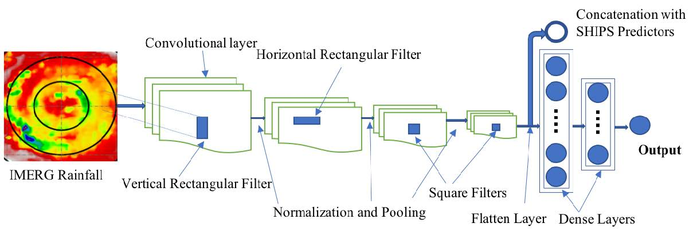

# Author: Sunny You
# References: https://doi.org/10.1175/WAF-D-24-0196.1
# Last Revised: 2025-10-24

This repository contains my code for my HIECNN, HIPCNN, and HRICNN models.
All 3 models are part of the Real Time HAI product (in development currently).

# Purpose
The purpose of this project is to create convolutional neural network (CNN) models that can estimate and predict hurricane intensity from satellite imagery. Each model focuses on a different aspect of hurricane intensity estimation: HIECNN estimates current intensity, HIPCNN predicts intensity changes over time, and HRICNN estimates rapid intensification events.

# Models
All the models accept satellite images and environmental data as inputs to produce their respective outputs.
- HIECNN (Hurricane Intensity Estimation CNN): Estimates current hurricane intensity from satellite images.
- HIPCNN (Hurricane Intensity Prediction CNN): Predicts future hurricane intensity changes based on current satellite images and environmental data.
- HRICNN (Hurricane Rapid Intensification CNN): Estimates the likelihood of rapid intensification events using satellite imagery and environmental factors.

# Example Input Images
The models utilize NASA IMERG satellite images as inputs. Below are examples of the input images used.

# Model Architecture and Framework
Below is a diagram illustrating the architecture of the CNN models used in this project.
