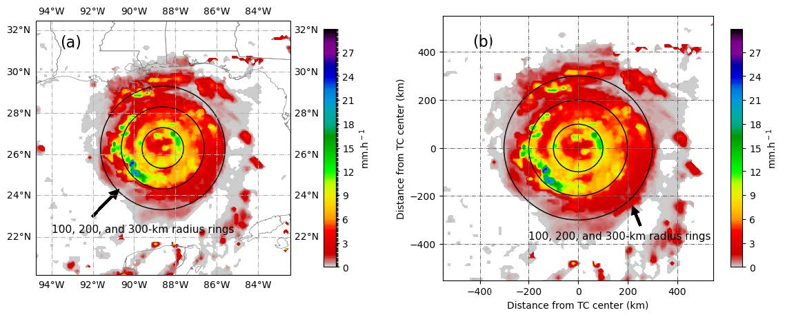
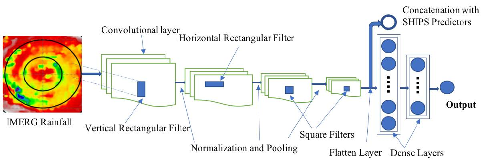

# Author: Sunny You
Peer-Reviewed Publication: You, S., P. Zhu, et al. 2025: Predicting Tropical Cyclone Intensity Using a Convolutional Neural Network and 20 Years of IMERG Satellite Rainfall Data, Weather and Forecasting, 40, 2317–2331. 
# DOI: https://doi.org/10.1175/WAF-D-24-0196.1
# Last Revised: 2025-10-31

This repository contains my code for my HIECNN, HCNN, and HRICNN models.
All 3 models are part of the Real Time HAI product (in development currently).

# Purpose
The purpose of this project is to create convolutional neural network (CNN) models that can estimate and predict hurricane intensity from satellite imagery. Each model focuses on a different aspect of hurricane intensity estimation: HIECNN estimates current intensity, HCNN predicts intensity changes over time, and HRICNN estimates rapid intensification events.

# Models
All the models accept satellite images and environmental data as inputs to produce their respective outputs.
- HIECNN (Hurricane Intensity Estimation CNN): Estimates current hurricane intensity from satellite images.
- HCNN (Hurricane CNN): Predicts future hurricane intensity changes based on current satellite images and environmental data.
- HRICNN (Hurricane Rapid Intensification CNN): Estimates the likelihood of rapid intensification events using satellite imagery and environmental factors.

# Example Input Images
The models utilize NASA IMERG satellite images as inputs. Below are examples of the input images used.


# Model Architecture and Framework
Below is a diagram illustrating the architecture of the CNN models used in this project.


# Technologies Used
- Python (TensorFlow, Keras, NumPy, Pandas)
- Jupyter Notebooks (for experimentation and prototyping)
- R (for data analysis and visualization)
- HTML/CSS/JS (for future web interface development)

# Demo Videos
- Web Demo for future HAI product: [YouTube Link](https://youtu.be/XXm4rNwczMw)
- HIECNN Model Explanation: [YouTube Link](https://youtu.be/Ioq_OeiLRXs)
- HCNN Model Explanation: [YouTube Link](https://youtu.be/_1DFHKlfxO8)
- HRICNN Model Explanation: [YouTube Link](https://youtu.be/WxH0oknacfo)

# Requirements
- Python 3.14
- R 4.6.1 (the version recorded in `renv.lock`)
- Python dependencies listed in `requirements.txt`
- A GPU is very helpful for speeding up model training and evaluation, but not strictly required for running the code.

# Setup and Experimentation
From the repository root, create the Python virtual environment and restore the
project-local R packages with:

```bash
./Environment_Setup.sh && source .venv/bin/activate
```

The setup script restores the R environment from `renv.lock` using
`renv::restore(prompt = FALSE)`. The committed `.Rprofile` and `renv/`
bootstrap files also ensure the project-local R library is activated when R is
started from the repository root. R package installation may require network
access the first time setup is run.

Each model has its own source code and experiment workflow. Run experimentation
scripts from the repository root. HRICNN's complete preprocessing, training,
evaluation, and SHAP workflow is documented in
[`HRICNN/README.md`](HRICNN/README.md) and can be run with:

```bash
./HRICNN/Experiment.sh
```

The HCNN and HIECNN directories currently contain their source code and
model-specific preprocessing scripts; consult their directory READMEs and
scripts for those workflows.
